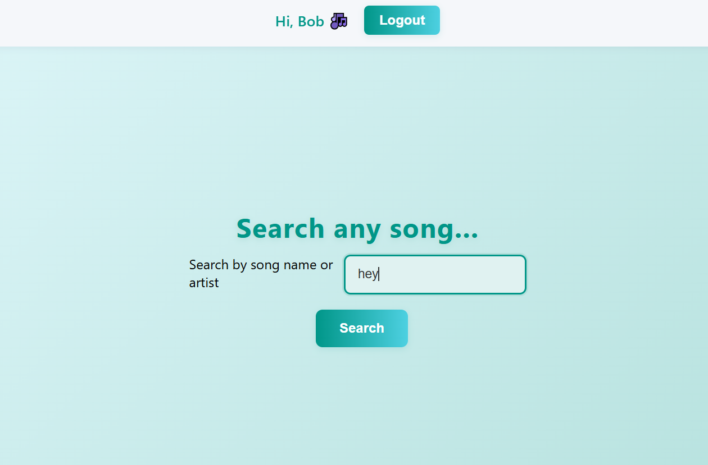
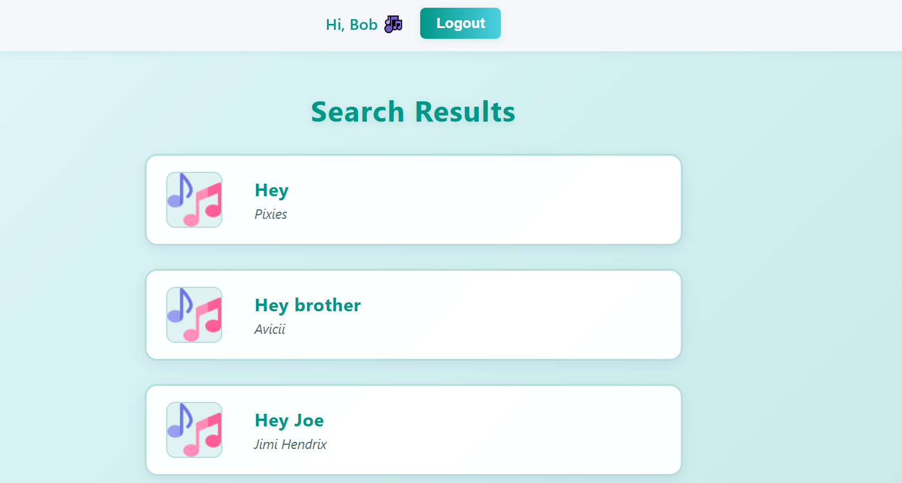
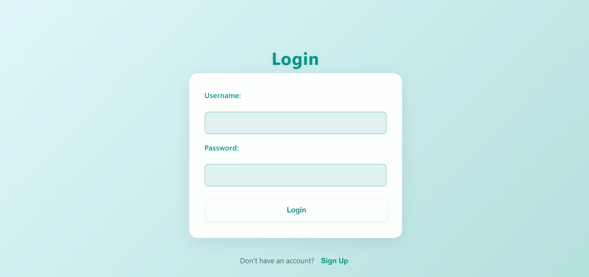

# JaMoveo – Real-Time Collaborative Song Session App 🎶

Welcome to **JaMoveo** – a vibrant platform for musicians and music fans to create, share, and enjoy songs together in real time! Whether you’re leading a jam or joining as a player, JaMoveo makes collaboration easy and fun. Enjoy live song sharing, instant updates, and a lively community—all in one place.

## Screenshots

## Features

**User Signup & Login & Logout**  
  Users register with a username, password, and selected instrument (e.g., vocals, guitar, drums).

 **Role-Based Access**  
  - **Player**: Joins rehearsals and sees songs based on instrument.
  - **Admin**: Can start a session, search for songs, and control what users see.

 **Song Search & Selection (Scraping)**  
    Admins can search for songs by title (English or Hebrew), view results, and select one to display.  
    Song data (lyrics and chords) is fetched by scraping [Tab4u.com](https://www.tab4u.com/).

 **Live Song Display**  
  - Singers see only lyrics.  
  - Other musicians see both chords and lyrics.  
  - High contrast and large fonts for visibility during smoky rehearsals.

-  **Auto Scroll**  
  Users can toggle slow auto-scrolling of song content during performance.

- **Real-Time Sync with Sockets**  
  All connected users are instantly updated when the admin selects a song or ends the session.

##  Tech Stack
- **Frontend**: React (TypeScript), React Router, TailwindCSS  
- **Backend**: Node.js, Express, socket.io  
- **Database**: MongoDB  
- **Real-Time**: socket.io  
- **Security**: JWT authentication

##  Pages

| Route            | Description                              |
|------------------|------------------------------------------|
| `/signup`        | Register as a player                     |
| `/admin-signup`  | Register as an admin                     |
| `/`              | Login with username/password             |
| `/logout`        | Logout                                   |
| `/player`        | Waiting screen for players               |
| `/admin`         | Search and start session (admin only)    |
| `/results`       | Song search results (admin only)         |
| `/live`          | Song display for all users               |

- **Role-Based Access**
    - Sign up as an **admin** or **player**.
    - Secure authentication with JWT.
    - Only authorized users can access protected areas.

- **Admin Tools**
    - Search for songs in English or Hebrew.
    - Fetch song titles and artists from Tab4u.com.
    - Select and broadcast songs to all players instantly.

- **Player Experience**
    - Wait in the lobby until a song is chosen.
    - View real-time lyrics and chords during the session.
    - Late arrivals are synced automatically.

- **Real-Time Collaboration**
    - Instant updates using Socket.io.
    - Stay in sync with song selections and session changes.

- **Song Data Integration**
    - Backend scrapes Tab4u.com for lyrics and chords.
    - Chords and lyrics are displayed together for easy playing.

- **User Interface**
    - Responsive React frontend for all users.
    - Simple navigation and clear feedback.

